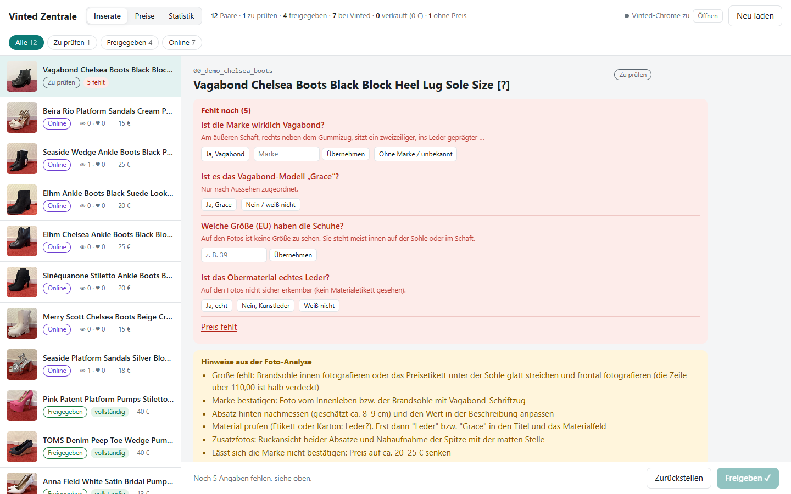

# Vinted Hub

A small, local sales hub for selling your own items on Vinted. It was built for listing a few dozen pairs of shoes on vinted.lu.

Drop in photos → Claude analyses them (brand, size, condition, heel height, price suggestion, listing text in English or German) →
you review and answer open questions with one click → the Vinted upload form is filled in automatically →
**you press “Upload” yourself** → views and favourites are tracked over time.



> The hub's interface is available in **English and German** (“Vinted Hub” / “Vinted Zentrale”), chosen in the settings menu.
> Code, file names, commands and data keys are English. The screenshots show the German interface.

## Features

| Area | What it does |
|---|---|
| **Analysis** | Photos (including iPhone HEIC) are grouped into pairs. For each pair, one agent reads labels, boxes and soles, estimates heel height and shape, researches prices and writes the listing. A second agent then tries to refute every claim. Nothing is guessed: uncertain facts are marked in the text and turned into questions. |
| **Listings** | Status workflow: to review → approved → draft → online → sold. A red “Still missing” box shows **one-click question buttons**. Each answer rewrites the title and the description for you, so you never edit the text by hand. You can also reorder photos, pick the cover photo and undo answers. |
| **Prices** | All pairs in one table: the research-based suggestion and **Vinted's own price suggestion** (bargain / optimal / premium). Use one with a click or type your own price. |
| **Fill in on Vinted** | Fills photos, title, description, category, brand, size, condition, colours, material, price and parcel size in your own logged-in Chrome. Runs one listing at a time (“Fill in on Vinted”) or all approved listings in a row (“Fill in all approved”). A human always presses submit; afterwards the hub detects on its own whether the listing went online or was saved as a draft. |
| **Statistics** | Reads views and favourites of all your listings (read-only) and stores every fetch. Shows KPI tiles, a trend chart and a per-listing comparison, with a table view. Sold items are detected automatically. |
| **Settings & languages** | The **Settings** menu in the header sets the **Interface language** (English / German) and, for new listings, the **Title language** and the **Description language** (English / German each). A description is always written in exactly one language. Every listing remembers the languages of its own texts, and the menu shows how many listings not yet on Vinted are in another language (Claude can rewrite them on request; the hub itself does not translate). |

| Prices | Vinted form, filled in automatically |
|---|---|
|  |  |


<details>
<summary>Statistics in dark mode</summary>


</details>

## How it works

```
0_input_photos/ ──► Claude Code analysis workflow ──► data/listings.json
                    (one analysis + one review agent per pair)
                                                          │
                              local hub (127.0.0.1:8765) ◄┘
                              review · answer questions · set prices · approve
                                                          │
             your own Chrome (logged in by you, attached via CDP) ◄┘
             form filled by Playwright ──► you click “Upload”
                                                          │
                              statistics: views / favourites over time ◄┘
```

- **No bot browser:** a browser launched by Playwright was blocked by Vinted's bot detection. The hub therefore starts a normal Chrome with its own profile. You log in yourself, and the scripts attach to that window over the Chrome DevTools Protocol.
- **Lightweight on purpose:** the server uses only the Python standard library plus Pillow. The UI is one HTML file with vanilla JavaScript and SVG charts, with no build step and no framework.
- **Safe with parallel edits:** writes use a file lock, atomic replace with a backup, and per-field conflict detection. Editing in the hub while a job runs does not lose changes.

## Setup (Windows)

Requirements: Python 3.9+ and Google Chrome.

```bat
python -m venv .venv
.venv\Scripts\python.exe -m pip install -r requirements.txt
```

No separate Playwright browser download is needed; the scripts use your installed Chrome.
The analysis step needs [Claude Code](https://claude.com/claude-code). The hub itself runs without it.

## Usage

1. Run **`Vinted Login.bat`**. It opens a normal Chrome window with a dedicated profile. Log in to Vinted yourself once and keep the window open.
2. Put your unsorted photos into **`0_input_photos/`** and tell Claude Code (opened in this folder) to analyse them, e.g. “New photos are in 0_input_photos, please analyse”. The agent instructions live in [`CLAUDE.md`](CLAUDE.md).
3. Run **`Start Hub.bat`**. It opens the hub at http://127.0.0.1:8765. Under **Settings** (header) you choose the interface language, the title language and the description language. The listing languages apply to analyses started after the change.
4. Answer the questions, set your prices and click **Approve ✓**. Then click **Fill in on Vinted** and submit the form yourself in the Vinted Chrome.
5. Now and then click **Fetch statistics** (in the header or in the **Statistics** view).

Every step also works from the command line:

```bat
.venv\Scripts\python.exe -m vinted_hub serve            :: start the hub (--no-browser to skip opening it)
.venv\Scripts\python.exe -m vinted_hub login            :: open the Vinted Chrome
.venv\Scripts\python.exe -m vinted_hub fill <folder>    :: fill the upload form for one listing
.venv\Scripts\python.exe -m vinted_hub fill-approved    :: fill all approved listings, one after another
.venv\Scripts\python.exe -m vinted_hub prices           :: read Vinted's price suggestion (saves nothing on Vinted)
.venv\Scripts\python.exe -m vinted_hub stats            :: fetch views and favourites
.venv\Scripts\python.exe -m vinted_hub explore          :: dump the upload form (when Vinted changes it)
.venv\Scripts\python.exe -m vinted_hub settings         :: show the settings as JSON
.venv\Scripts\python.exe -m vinted_hub settings set description_language=de ui_language=en   :: change settings
```

A short day-to-day guide for the seller is in [`docs/GUIDE.en.md`](docs/GUIDE.en.md) (English) and [`docs/GUIDE.md`](docs/GUIDE.md) (German).

## Project structure

```
vinted_hub/                Python package – python -m vinted_hub <command>
  core.py                  config and settings, paths, data read/write (with file lock), photo handling
  i18n.py                  translations of server and CLI messages (English source, German in DE)
  chrome.py                start / attach to the Vinted Chrome via CDP
  form.py                  fill the Vinted upload form, read the price recommendation
  commands.py              CLI commands (login, fill, fill-approved, prices, stats, explore)
  server.py                local hub server (standard library + Pillow)
  web/hub.html             hub UI (single file, vanilla JS, SVG charts, English + German texts)
tools/                     contact_sheet.py · check_listing.py · import_listings.py · explore_dropdowns.py
.claude/workflows/         vinted-analysis.js – analysis workflow for Claude Code
config.json                domain, ports, folders, default settings
Start Hub.bat              start the hub
Vinted Login.bat           open the Vinted Chrome
data/                      all personal data (not in git)
docs/                      GUIDE.en.md / GUIDE.md (user guide, English / German) · images/ (screenshots)
CLAUDE.md / AGENTS.md      instructions for AI coding agents
```

## Configuration

`config.json`:

| Key | Meaning |
|---|---|
| `domain` | Vinted site, e.g. `https://www.vinted.lu` |
| `ui_language` | default interface language: `en` or `de` (also used for messages and for the seller-facing texts of new analyses: questions, hints, price reasoning) |
| `title_language` | default language of titles written by new analyses: `en` or `de` |
| `description_language` | default language of descriptions written by new analyses: `en` or `de` (always exactly one language) |
| `input_folder` / `data_folder` | drop folder for new photos / folder for all personal data |
| `hub_port` / `chrome_port` | port of the hub (8765) / remote-debugging port of the Vinted Chrome (9222) |
| `max_photos` | maximum number of photos per listing |

The three language keys in `config.json` are only defaults (all `en`). Your own choice is stored in **`data/settings.json`**
(personal, not in git), which the hub's settings dialog writes, e.g. `{"ui_language": "de", "title_language": "en", "description_language": "en"}`.
You can also change it with `python -m vinted_hub settings set key=value`. Changing a language affects the interface and new analyses;
existing listings keep their texts.

## Privacy

All personal data stays **local** and is excluded via `.gitignore`:

- photos (`0_input_photos/`, `data/items/`)
- listings (`data/listings.json`), statistics (`data/stats.json`) and your settings (`data/settings.json`)
- analysis results (`data/analysis/`) and the archive (`data/archive/`)
- debug output (`data/debug/`)
- the browser profile with your Vinted login (`data/browser-profile/`)

Before upload, photos are rotated, resized and saved **without GPS metadata**.

## Disclaimer

Vinted's terms of service prohibit automated tools. This project is meant for small-scale private use and is deliberately gentle:

- it uses a real browser that you log in to yourself;
- it fills one listing at a time;
- it **never submits anything on its own**;
- it fetches statistics only when you click the button.

Use it at your own risk. This project is not affiliated with Vinted.
