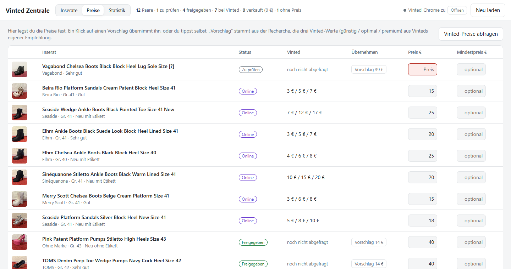
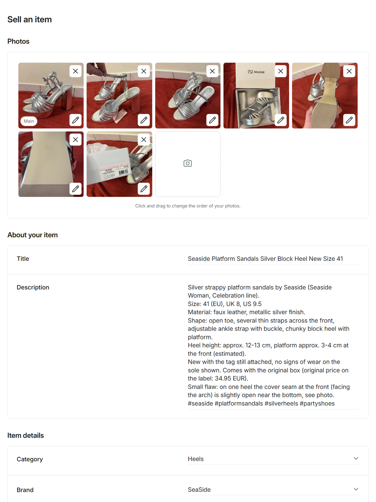
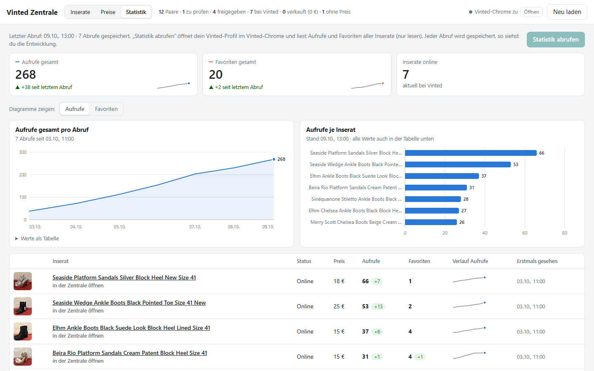
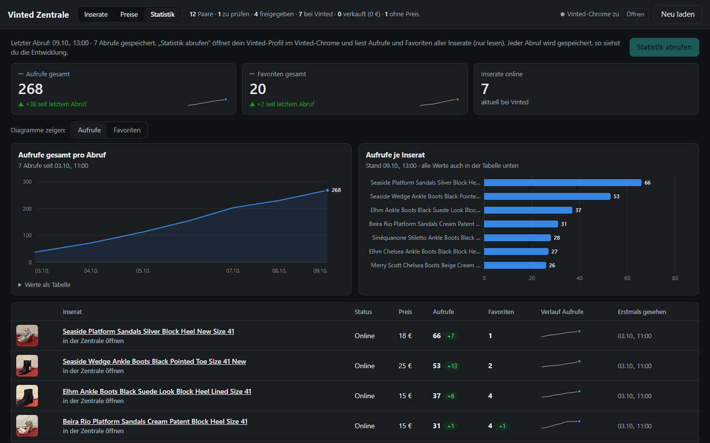

# Vinted Zentrale

**DE:** Eine kleine, lokale Verkaufs-Zentrale für private Vinted-Verkäufe (gebaut für Schuhe auf vinted.lu).
Fotos rein → Claude analysiert sie (Marke, Größe, Zustand, Absatzhöhe, Preisvorschlag, zweisprachiger Text) →
du prüfst und beantwortest offene Fragen per Knopf → das Vinted-Formular wird automatisch ausgefüllt →
**du klickst selbst auf „Hochladen“** → Aufrufe und Favoriten werden verfolgt.

**EN:** A small, local sales hub for private Vinted sales (built for shoes on vinted.lu).
Drop in photos → Claude analyses them (brand, size, condition, heel height, price suggestion, bilingual text) →
you review and answer open questions with one click → the Vinted form is filled in automatically →
**you press “Upload” yourself** → views and favourites are tracked.


---

## Deutsch

### Was die Zentrale kann

| Bereich | Funktion |
|---|---|
| **Analyse** | Fotos (auch iPhone-HEIC) werden zu Paaren sortiert; pro Paar liest ein Agent Etiketten, Kartons und Sohlen, ein zweiter prüft alles kritisch gegen. Nichts wird geraten: Unsicheres wird als Frage gestellt. |
| **Inserate** | Liste mit Status (Zu prüfen → Freigegeben → Entwurf → Online → Verkauft), roter Kasten „Fehlt noch“ mit **Fragen-Knöpfen** – ein Klick passt Titel und Beschreibung (Englisch + Deutsch) automatisch an. Fotos sortieren, Titelbild wählen, Rückgängig. |
| **Preise** | Alle Paare in einer Tabelle: Recherche-Vorschlag und **Vinteds eigene Preisempfehlung** (günstig / optimal / premium) per Klick übernehmen oder selbst eintragen. |
| **Vinted ausfüllen** | Füllt im eigenen, eingeloggten Chrome Fotos, Titel, Beschreibung, Kategorie, Marke, Größe, Zustand, Farben, Material und Preis aus – einzeln oder alle freigegebenen nacheinander. Abschicken macht immer der Mensch. |
| **Statistik** | Liest Aufrufe und Favoriten aller eigenen Inserate (nur lesen), speichert jeden Abruf und zeigt Kennzahlen, Verlauf und Vergleich je Inserat als Diagramme. Verkaufte Artikel werden automatisch erkannt. |

| Preise | Vinted-Formular, automatisch ausgefüllt |
|---|---|
|  |  |



<details>
<summary>Statistik im dunklen Modus</summary>


</details>

### Installation (Windows)

Voraussetzungen: Python 3.9+ und Google Chrome.

```bat
python -m venv .venv
.venv\Scripts\python.exe -m pip install -r requirements.txt
```

Ein eigener Playwright-Browser wird **nicht** gebraucht – die Skripte verbinden sich mit deinem installierten Chrome.

### Benutzung

1. **`Vinted Login.bat`** – öffnet einen normalen Chrome mit eigenem Profil. Einmal selbst bei Vinted einloggen, Fenster offen lassen.
2. Fotos unsortiert in **`0_input_foto/`** legen und Claude (Claude Code im Projektordner) sagen:
   „Neue Fotos sind in 0_input_foto, bitte analysieren.“ – die Arbeitsanweisung steht in [`CLAUDE.md`](CLAUDE.md).
3. **`Freigabe starten.bat`** – öffnet die Zentrale unter http://127.0.0.1:8765.
4. Fragen beantworten, Preise festlegen, **Freigeben**, dann **„In Vinted ausfüllen“** und im Vinted-Chrome selbst abschicken.
5. Ab und zu **„Statistik abrufen“**.

Kurzanleitung für den Alltag: [`ANLEITUNG.md`](ANLEITUNG.md).

### Projektstruktur

```
vinted.py                  CLI: login, freigabe, ausfuellen, hochladen, preise, statistik, erkunden
freigabe.py                lokaler Server der Zentrale (nur Standardbibliothek + Pillow)
web/freigabe.html          Oberfläche (eine Datei, Vanilla-JS, Diagramme als SVG)
werkzeuge/                 kontaktbogen.py · pruefe_inserat.py · uebernehmen.py · dropdowns_erkunden.py
.claude/workflows/         vinted-analyse.js – Analyse-Workflow für Claude Code
config.json                Domain, Ports, Sprache der Inseratstexte (en+de)
CLAUDE.md / AGENTS.md      Arbeitsanweisung für KI-Agenten
```

### Daten & Datenschutz

Persönliche Daten bleiben **lokal** und sind per `.gitignore` ausgeschlossen: Fotos (`0_input_foto/`, `schuhe/`),
Inserate (`inserate.json`), Statistik (`statistik.json`), Analyse-Ergebnisse, Archiv, Debug-Ausgaben und das
Browser-Profil mit dem Vinted-Login. Fotos werden vor dem Hochladen gedreht, verkleinert und **ohne GPS-Metadaten** gespeichert.

### Hinweis zu Vinted

Vinteds Nutzungsbedingungen untersagen automatisierte Werkzeuge. Dieses Projekt ist für den kleinen privaten Gebrauch
gedacht und arbeitet bewusst schonend: echter, selbst eingeloggter Browser, ein Inserat nach dem anderen, **kein
automatisches Absenden**, Statistik nur auf Knopfdruck. Die Nutzung erfolgt auf eigenes Risiko.

---

## English

### Features

- **Analysis** – photos (incl. iPhone HEIC) are grouped into pairs; one agent per pair reads labels, boxes and soles, a second one tries to refute every claim. Nothing is guessed – uncertain facts become questions.
- **Listings** – status workflow (to review → approved → draft → online → sold), a “missing” box with **one-click questions** that rewrite title and the bilingual (English + German) description, photo ordering, undo.
- **Prices** – one table with the research suggestion and **Vinted’s own price recommendation**; adopt with a click or type your own.
- **Fill in Vinted** – fills photos, title, description, category, brand, size, condition, colours, material and price in your own logged-in Chrome, one by one or all approved listings in a row. A human always presses submit.
- **Statistics** – reads views and favourites of all your listings (read-only), stores every fetch and shows KPIs, trend and per-listing charts; sold items are detected automatically.

### Setup (Windows)

```bat
python -m venv .venv
.venv\Scripts\python.exe -m pip install -r requirements.txt
```

Requires Python 3.9+ and Google Chrome (no separate Playwright browser download).

### Usage

1. `Vinted Login.bat` – log in to Vinted yourself in the dedicated Chrome window and keep it open.
2. Put photos into `0_input_foto/` and ask Claude Code (in this folder) to analyse them – see [`CLAUDE.md`](CLAUDE.md).
3. `Freigabe starten.bat` – opens the hub at http://127.0.0.1:8765.
4. Answer questions, set prices, approve, click **“In Vinted ausfüllen”**, then submit in the Vinted Chrome yourself.

### Privacy

All personal data (photos, listings, statistics, browser profile) stays local and is excluded via `.gitignore`.
Upload photos are rotated, resized and stripped of GPS metadata.

### Disclaimer

Vinted’s terms prohibit automated tools. This project is meant for small-scale private use, works gently (real,
user-logged-in browser, one listing at a time, **never submits on its own**) and is used at your own risk.
